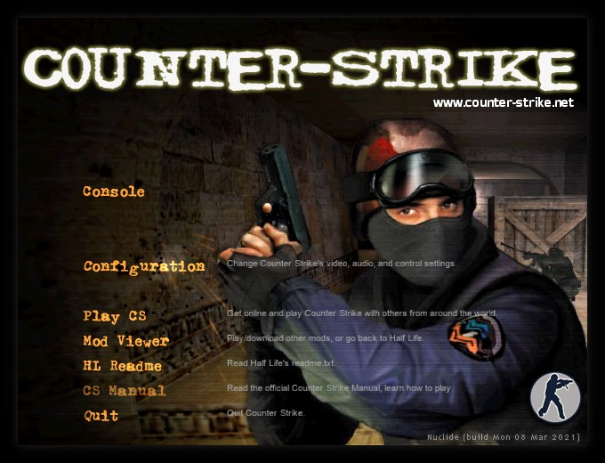
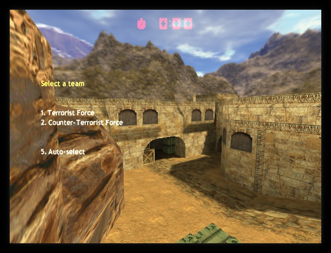
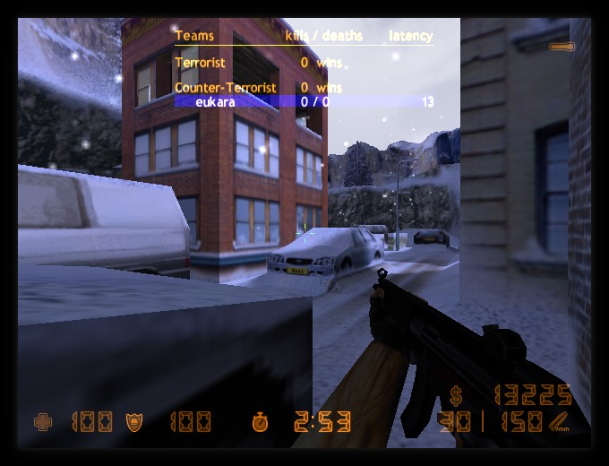
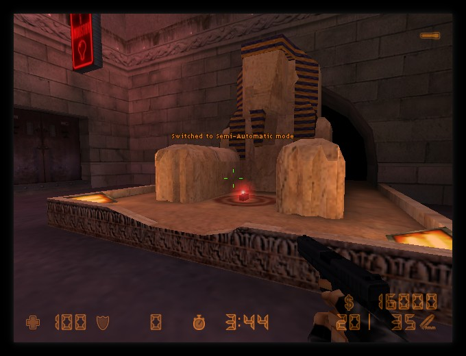

# FreeCS
[As seen on phoronix.com](https://phoronix.com/scan.php?page=news_item&px=FreeCS-Open-Counter-Strike)

Clean-room reimplementation of Counter-Strike 1.5 (mod-version).

Aiming for a stable reimagining of the original mod in QuakeC.
Not aiming for accuracy, but for a smooth, exploit and bug-free
experience over the Internet.

Done in my freetime for countless reasons, but most important to me: to learn everything there is to know about one of my favorite games.

This is all 100% new, original code written by good old trial and error.
**Differences exist** and features are slowly being implemented one by one.
This allows the code to be fully free and unencumbered, unlike similar projects.

Featuring proper weapon prediction to enable stress-free netplay.

The engine you want to use to run this is FTEQW (https://www.fteqw.org), which is a project unrelated to this. It just happens to support the file-formats FreeHL needs.

## Features and Improvements
* Native support for Windows/Mac/Linux/BSD and wherever else FTEQW runs on
* Better support for higher display modes and aspect ratios
* Much easier modding by having the entire logic be in modern QuakeC
* Netcode that's always improving and more advanced prediction
* Open-source code for transparent modding
* Very permissive license (ISC/BSD)
* The code doesn't rely on others work, so nobody can shut it down :-)

## Installation
Grab the latest binary release, extract and put an FTEQW engine binary (for your platform) into the same folder as the default.fmf and readme file.
Get FTEQW here: https://www.fteqw.org/

Run the engine and when in-game download the needed content, or optionally merge your own HL + CS 1.5 installation.

### Notes

*You'd think this disclaimer may be unnecessary but here we go:*

**This project is designed for the CS 1.5 data files.**

You will have a bad time if you use it with later or earlier versions.

You won't be able to connect to most people their servers. Content may be missing.

This is designed for CS 1.5 and the Half-Life CD data files **ONLY**.
**If you want to play and later version of CS, please do it on Steam.**

## Building
Here's the quick and dirty instructions for those unfamilar:

First of all, make sure you've got Nuclide cloned.

> git clone https://github.com/veravisions/nuclide

Then, **inside** of the cloned repo, you'll clone FreeHL.

> git clone https://github.com/eukara/freehl valve

Then, in the same directory (Nuclide's) you will clone this repo.

> git clone https://github.com/eukara/freecs cstrike

Run 
> ./build_game.sh valve

First, so we have a usable menu.

then either run Nuclide's `./build_game.sh cstrike` shell script, or issue `make` inside
./cstrike/src for whenever you need to recompile FreeCS.

** !! You need to also provide data-files !! **

There's separate scripts inside FreeHL's cloned valve/ directory and FreeCS's cstrike/ directory
for grabbing/moving the data files from various install media.

The archive.org scripts for Half-Life will download content from the various demo builds of Half-Life, and can use yt-dlp for grabbing the music. You should be able to get everything required to play off the Internet.

## Community

### Matrix
If you're a fellow Matrix user, join the Nuclide Space to see live-updates and more!
https://matrix.to/#/#nuclide:matrix.org

### IRC
Join us on #freecs via irc.libera.chat and talk/lurk or discuss bugs, issues
and other such things. It's bridged with the Matrix room of the same name!

### Others
We've had people ask in the oddest of places for help, please don't do that.

## License
ISC License

Copyright (c) 2016-2021 Marco Hladik <marco@icculus.org>

Permission to use, copy, modify, and distribute this software for any
purpose with or without fee is hereby granted, provided that the above
copyright notice and this permission notice appear in all copies.

THE SOFTWARE IS PROVIDED "AS IS" AND THE AUTHOR DISCLAIMS ALL WARRANTIES
WITH REGARD TO THIS SOFTWARE INCLUDING ALL IMPLIED WARRANTIES OF
MERCHANTABILITY AND FITNESS. IN NO EVENT SHALL THE AUTHOR BE LIABLE FOR
ANY SPECIAL, DIRECT, INDIRECT, OR CONSEQUENTIAL DAMAGES OR ANY DAMAGES
WHATSOEVER RESULTING FROM LOSS OF MIND, USE, DATA OR PROFITS, WHETHER
IN AN ACTION OF CONTRACT, NEGLIGENCE OR OTHER TORTIOUS ACTION, ARISING
OUT OF OR IN CONNECTION WITH THE USE OR PERFORMANCE OF THIS SOFTWARE.
 
